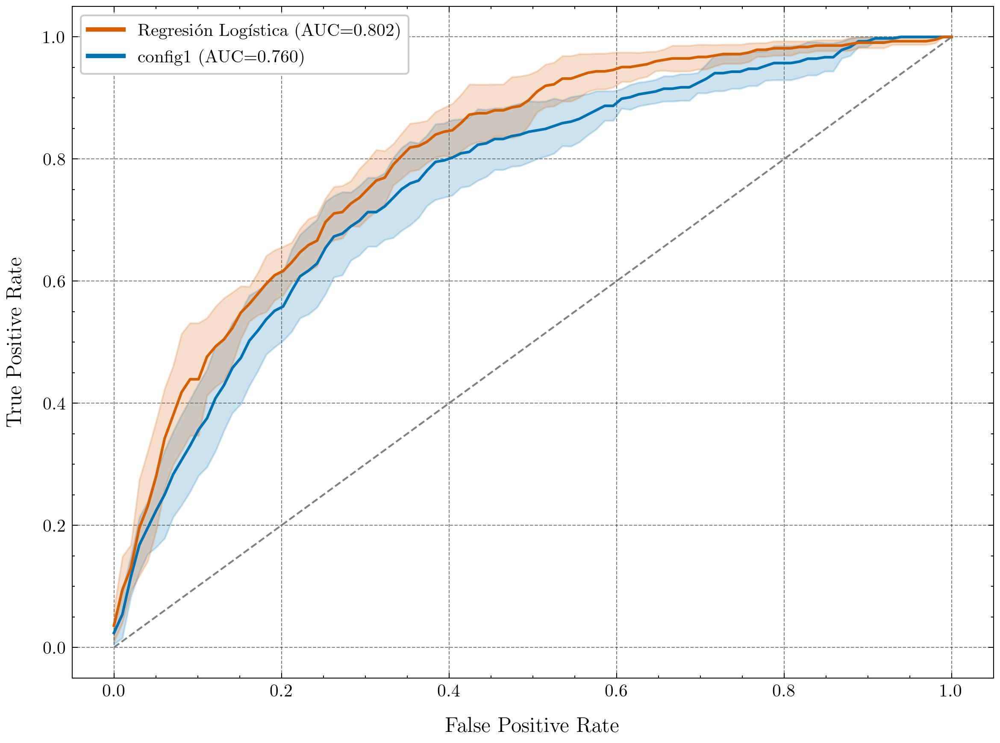

# Clasificación del cáncer de próstata con IA y RMmp

Este Trabajo de Fin de Grado compara la radiómica y las técnicas de deep learning 
en la clasificación de la severidad del cáncer de próstata mediante 
imágenes de resonancia magnética multiparamétrica (RMmp), 
tanto en términos de rendimiento como de explicabilidad.

## Índice de contenidos

- [Introducción](#introducción)  
- [Conjunto de datos](#conjunto-de-datos)  
- [Metodología](#metodología)  
- [Resultados](#resultados)  
- [Estructura del repositorio](#estructura-del-repositorio)  
- [Dependencias](#dependencias)  
- [Instalación](#instalación)  
- [Uso](#uso)  
- [Referencias](#referencias)

## Introducción

El cáncer de próstata es uno de los cánceres más comunes entre los hombres 
y presenta una evolución clínica muy diversa, desde tumores indolentes hasta 
formas más agresivas. La resonancia magnética multiparamétrica (RMmp) se ha 
consolidado como una alternativa más precisa y menos invasiva frente a métodos 
tradicionales como el PSA o la biopsia. En este contexto, la inteligencia artificial 
ofrece herramientas de apoyo con gran potencial para discriminar entre distintos 
niveles de severidad, mediante dos enfoques principales: la radiómica y el deep learning. 
Ambos deben combinar buen rendimiento diagnóstico con explicabilidad para 
facilitar su integración clínica.

## Conjunto de datos

Este estudio utiliza el conjunto de datos público del reto [PI-CAI](https://pi-cai.grand-challenge.org/) [1], 
compuesto por 1.500 casos con sospecha de cáncer de próstata. 
Para cada caso se emplean imágenes en plano axial de tres secuencias de 
resonancia magnética: T2W, DWI y ADC. También se utilizan segmentaciones 
automáticas de la glándula prostática y una variable binaria que indica 
la presencia o ausencia de cáncer clínicamente significativo, 
definida como un grado ISUP ≥ 2.

## Metodología

1. **Análisis radiómico**. Se extraen características radiómicas a partir de las imágenes de resonancia 
magnética. Estas características se utilizan para entrenar modelos clásicos de Machine Learning.

2. **Deep Learning**. Se entrenan varios modelos basados en redes neuronales convolucionales 3D 
directamente sobre las imágenes, sin necesidad de extracción manual de características.

3. **Comparación del rendimiento**. Utilizando test estadísticos, se comparan los distintos modelos entrenados dentro de cada enfoque 
y, posteriormente, se analizan las diferencias globales entre radiómica y deep learning.

   
4. **Interpretabilidad de los modelos**. Se analizan las decisiones de los modelos mediante técnicas 
de explicabilidad con el objetivo de valorar su utilidad clínica.

## Resultados

<!-- TO-DO -->

<p align="center">
  
</p>

## Estructura del repositorio

```
├── artifacts/
│   ├── deep_learning/ # Logs, modelos y CSVs con los resultados de los modelos de DL
│   └── radiomics/     # Características radiómicas
├── data_analysis/     # Análisis exploratorio de los datos
├── data_structuring/  # Notebook que centraliza todos los datos
├── results/
│   ├── deep_learning/ # Resultados del análisis comparativo entre los modelos de DL
│   └── radiomics/     # Métricas y resultados de radiómica
├── train/
│   ├── deep_learning/ # Scripts de entrenamiento de modelos de deep learning
│   └── radiomics/     # Scripts de extracción y modelado de radiómica
```

## Dependencias

La versión actual del repositorio depende de las siguientes bibliotecas de Python:

- joblib==1.4.2  
- lime==0.2.0.1  
- matplotlib==3.10.1  
- monai==1.4.0  
- nibabel==5.3.2  
- numpy==2.2.5  
- pandas==2.2.3  
- SciencePlots==2.1.1  
- scikit_learn==1.6.1  
- scikit_optimize==0.10.2  
- scipy==1.15.2  
- seaborn==0.13.2  
- shap==0.46.0  
- SimpleITK==2.5.0  
- statsmodels==0.14.4  
- torch==2.5.1  
- tqdm==4.67.1

## Instalación

1. Clona este repositorio:

   ```bash
   git clone https://github.com/jose-valero-sanchis/prostate_cancer_TFG.git
   cd prostate_cancer_TFG
   ```

2. Instala las dependencias:

    ```
    pip install -r requirements.txt
    ```

## Uso

1. **Preparación de los datos**. Crear el archivo CSV que centraliza toda la información necesaria para el entrenamiento: rutas a las imágenes, segmentaciones y variable objetivo. El notebook que construye este CSV se encuentra en [Data Structuring](./data_structuring/).

2. **Entrenamiento y validación**. Ejecutar los scripts correspondientes para entrenar y validar los modelos, ya sea del enfoque [radiómico](./train/radiomics/), de [deep learning](./train/deep_learning/) o de ambos.


## Referencias

[1] A. Saha, J. S. Bosma, J. J. Twilt, B. van Ginneken, A. Bjartell, A. R. Padhani, 
D. Bonekamp, G. Villeirs, G. Salomon, G. Giannarini, J. Kalpathy-Cramer, J. Barentsz, 
K. H. Maier-Hein, M. Rusu, O. Rouvière, R. van den Bergh, V. Panebianco, V. Kasivisvanathan, 
N. A. Obuchowski, D. Yakar, M. Elschot, J. Veltman, J. J. Fütterer, M. de Rooij, 
H. Huisman, and the PI-CAI consortium. 
“Artificial Intelligence and Radiologists in Prostate Cancer Detection on MRI (PI-CAI): 
An International, Paired, Non-Inferiority, Confirmatory Study”. 
The Lancet Oncology 2024; 25(7): 879-887.
